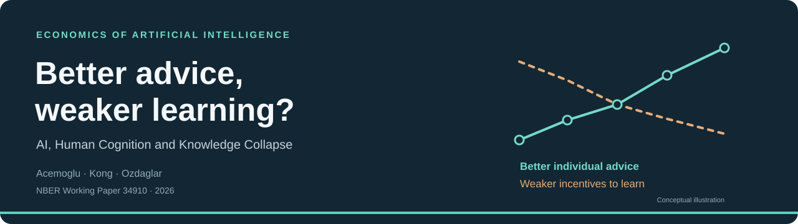

**A reading, computational exploration and formal verification of Acemoglu, Kong and Ozdaglar’s _AI, Human Cognition and Knowledge Collapse_.** NBER Working Paper 34910, February 2026. Prepared by Gabriel Saco with AI assistance.

[Read the paper](w34910.pdf) · [Five-minute presentation](presentation.pdf) · [Extended presentation](extra/presentation-extended.pdf) · [Lean verification](lean/README.md)

## The question

Can personalized AI improve individual decisions while weakening the shared knowledge that makes those decisions useful?

The paper connects two ideas: people substitute AI advice for their own learning today, and their learning helps produce the public knowledge inherited by others tomorrow. A good individual decision can therefore have a social cost that the individual does not bear.

## The agent’s problem

A person combines general understanding with information specific to their situation. They choose how much effort to spend learning, balancing better decisions against the cost of that effort. AI provides additional personalized information. Human effort also produces a small contribution to shared knowledge, but the person does not account for its benefit to future users.

The baseline makes a strong assumption: **personalized information has no productive value without general knowledge.**

## Main findings

| Finding | What it means |
|---|---|
| Shared knowledge encourages effort. | Better general understanding makes learning about one’s own situation more valuable. |
| Agentic advice discourages effort. | AI supplies information that the person would otherwise work to acquire. |
| Better AI improves the static choice. | Holding shared knowledge fixed, more accurate advice raises the best attainable payoff. |
| Long-run welfare need not improve. | Lower human effort can erode the shared knowledge on which future decisions depend. |
| The best accuracy level need not be interior. | The paper’s precise propositions allow the welfare-maximizing level of agentic accuracy to be zero. |

These are conditional theoretical results. The strict static effects require positive inherited knowledge, productive human learning, complementary knowledge inputs, independent Gaussian information and increasingly costly effort. The agents are short-lived and do not internalize their public-learning contribution. Long-run conclusions additionally depend on effort responsiveness, initial knowledge and restrictions on prior information. The [detailed reading notes](extra/analysis.md) preserve the full conditions and boundary cases.

## The assumption that changes the interpretation

Section 5 lets AI improve information aggregation, generate synthetic information and change how learning effort contributes to public knowledge. **It never relaxes the assumption that personalized information is worthless without general knowledge.**

This repository tests that restriction by giving personalized information some value on its own. Both effort effects survive: shared knowledge still encourages learning, and agentic advice still crowds it out. What changes is the boundary: **even with no inherited public knowledge, some positive effort improves the person’s payoff.**

That separates a robust substitution mechanism from the stronger premise supporting exactly zero effort. It does not establish that AI always improves long-run welfare.

## What Lean verifies

**Ten formal results pass the Lean checker, with no proof holes or added axioms.** The Gaussian function is constructed from an integral; its derivatives and signs are proved rather than assumed.

| Verified result | Qualification |
|---|---|
| Gaussian derivatives and signs | Positive precision; the probability model itself is not constructed. |
| Observation 1 | The actual mixed derivatives of the baseline payoff. |
| Persistence of both signs in the extension | Personalized information may have standalone value. |
| The first-order condition | Identifies stationary effort; does not establish existence. |
| Negative payoff curvature | At positive effort and inherited knowledge. |
| Uniqueness of an interior stationary choice | At most one such choice, not a global existence theorem. |
| Signs of effort responses | Conditional on the differentiated optimality equations. |
| Increasing static optimized payoff | Shared knowledge is fixed; maximizers are supplied as witnesses. |
| Zero effort in the baseline boundary case | Every positive effort pays less when inherited knowledge is absent. |
| A profitable positive effort in the extension | Proves that an improving feasible choice actually exists. |

**The paper remains partially formalized.** These checks do not prove dynamic collapse, long-run welfare, or that every formal statement perfectly captures the paper’s prose. The correspondence was reviewed by the authoring AI, not an independent human reviewer. The badges report the recorded validation, not a live continuous-integration service.

[Validation report](lean/FINAL_VALIDATION_REPORT.md) · [Readable formal statements](lean/PaperInterface.lean) · [Source-to-proof map](lean/audit/statement-map.md) · [Machine-readable results](lean/audit/validation.json)

## Computational evidence

The static experiments check **six symbolic identities and 444 numerical choices**. Numerical solutions satisfy the optimality condition to machine precision, and independent finite-difference checks agree with the analytical responses. The examples preserve the production normalization when standalone value is introduced.

These are illustrative calculations, not estimates from data. Dynamic paths, collapse thresholds and long-run welfare results are read-only throughout this project.

[Simulation source](extra/static_checks.py) · [Complete numerical results](extra/results/static_grid.csv) · [Check report](extra/results/checks.json)

## Explore and reproduce

| Material | Where to start |
|---|---|
| Five-minute talk and editable source | [Presentation](presentation.pdf) · [LaTeX source](presentation.tex) |
| Sixteen-slide extended discussion | [Extended deck](extra/presentation-extended.pdf) · [Source](extra/presentation-extended.tex) |
| Derivations, assumptions and speaking notes | [Analysis](extra/analysis.md) · [Oral script](extra/oral-notes.md) |
| Lean proofs and verification instructions | [Lean guide](lean/README.md) |
| Static experiments and deck build instructions | [Extra materials](extra/README.md) |
| Raw AI prompts and relevant answers | [Prompt record](prompts.md) |
| Handwritten verification requirement | [Hand folder](hand/README.md) |

**Submission status:** the handwritten derivation photo is still missing. Both decks clearly mark its place; the image must document genuine work done by hand.

**Reading note:** in the supplied version, Section 2 is the literature review. The static model is in Sections 3.1–3.5, with Observation 1 in Section 3.4.

The formalization structure follows the approach of [EconCSLib](https://gargnikhil.com/EconCSLib/) and the earlier [Quispe and Xu assignment](https://github.com/gsaco/ai-03-quispe). It is an independent mathlib project, not an EconCSLib contribution. Repository code is covered by the [MIT license](LICENSE); the supplied paper retains its authors’ copyright.
