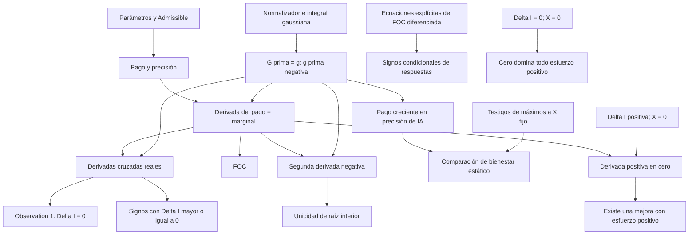

# Dependencias de las pruebas

Los nodos de ecuaciones diferenciadas y testigos maximizadores son **premisas**, no resultados demostrados por este proyecto. No hay nodos de recursión de precisión, equilibrio dinámico o bienestar de estado estacionario.

Los diez tipos públicos están en `PaperInterface.lean`; los resultados del tipo exacto están en `ProofInterface.lean`. El grafo resume dependencias matemáticas; no es una extracción automática de todas las declaraciones internas de Lean.
